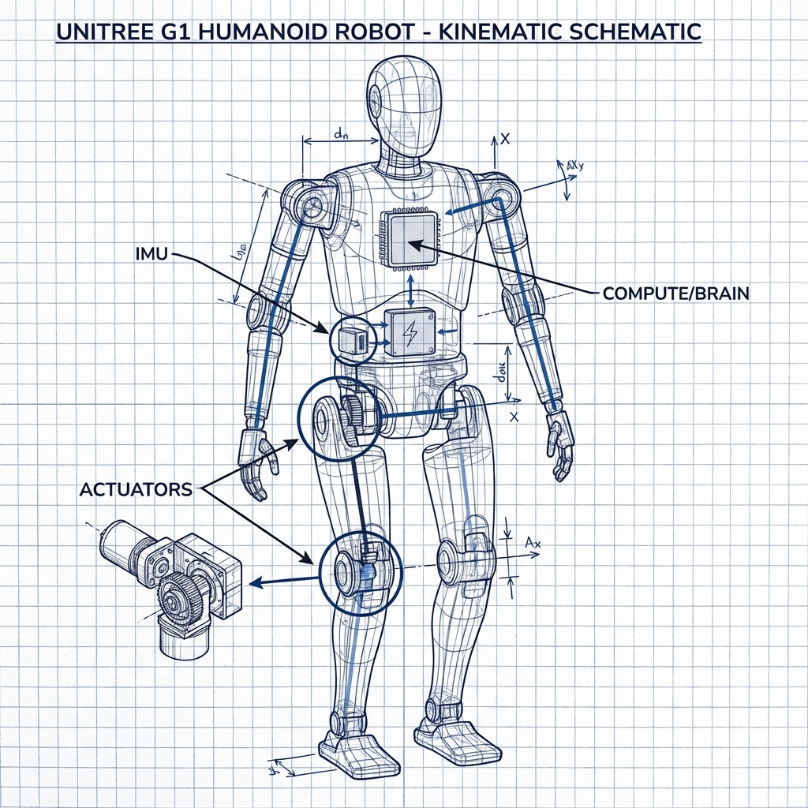

# Lesson 1.3: Entering "The Matrix"

This is the most important lesson in the entire book. By the end, you'll have a working robotics simulation environment on your own computer. Once this works, you can run every example in the book.

---

## The Concrete Hook: Your First Simulation

It's time to bring the robot to life. In this lesson, you will:

1. Set up a Python environment with the necessary packages
2. Install MuJoCo—the industry-standard physics simulator
3. Run a script that loads the Unitree G1 model
4. See your robot standing in a virtual world



This might seem like "just setup," but don't underestimate its importance. Professional robotics researchers spend significant time ensuring their simulation environment is correct. A broken setup means everything that follows will fail.

---

## The Intuition: What Is a Physics Simulator?

A physics simulator is like a video game engine, but optimized for scientific accuracy rather than entertainment. It computes forces, collisions, gravity, and friction according to real physics equations.

We use simulators for robot learning because of two key advantages:

### 1. Safety

It's much safer to crash a simulated robot than a real one. You can:
- Have the robot fall 10,000 times without any damage
- Try dangerous maneuvers without risk to humans or property
- Explore extreme edge cases that would be irresponsible to test in reality

### 2. Speed

Modern simulators can run **faster than real-time**. On a good GPU, you can simulate hours of robot experience in seconds. This is essential for reinforcement learning, where robots may need millions of trials to learn.

| | Real World | Simulation |
|-|-----------|------------|
| 1 hour of experience | 1 hour | ~1 second |
| Cost of failure | $$$ (repairs) | $0 |
| Reset time | Minutes | Milliseconds |
| Parallelization | 1 robot | 1000+ environments |

### Why MuJoCo?

**MuJoCo** stands for **Mu**lti-**Jo**int dynamics with **Co**ntact. It was originally developed by Emo Todorov at the University of Washington, later acquired by Google DeepMind, and is now open-source.

MuJoCo is the industry standard for robotics research because:
- **Fast**: Highly optimized C code
- **Accurate**: Excellent contact physics for walking robots
- **Well-documented**: Extensive documentation and examples
- **Free**: Open-source since 2022

Other popular options include Isaac Sim (NVIDIA), PyBullet, and Drake, but MuJoCo is our choice for this book.

---

## The Analogy: A Digital Crash Test Facility

Imagine you're designing a new car. You wouldn't build a full-scale prototype and crash it every time you want to test a safety feature—that would cost millions of dollars and take months.

Instead, you use a computer simulation. You model the physics of the crash, run thousands of variations, and only build a physical prototype once you're confident in the design.

Physics simulators are exactly this, but for robots. They're a digital playground where we can:
- Break things without consequence
- Test ideas rapidly
- Train AI systems with virtually unlimited data
- Iterate and improve before touching real hardware

---

## The Code: Setting Up Your Environment

Let's get your environment ready. We'll use Python's virtual environment to keep dependencies clean.

### Step 1: Create a Virtual Environment

Open your terminal and navigate to your project folder:

```bash
# Navigate to your project directory
cd your_project_folder

# Create a virtual environment
python -m venv .venv

# Activate it
# On macOS/Linux:
source .venv/bin/activate

# On Windows (PowerShell):
.\.venv\Scripts\Activate.ps1

# On Windows (Command Prompt):
.\.venv\Scripts\activate.bat
```

You should see `(.venv)` at the beginning of your terminal prompt, indicating the environment is active.

### Step 2: Install Dependencies

```bash
# Install MuJoCo and supporting libraries
pip install mujoco numpy matplotlib

# Verify installation
python -c "import mujoco; print(f'MuJoCo version: {mujoco.__version__}')"
```

If you see a version number (like `3.1.0`), you're ready!

### Step 3: Get the Robot Model

MuJoCo uses MJCF (MuJoCo Format) XML files to define robots. For this book, we use a simplified Unitree G1 model.

Create a file called `unitree_g1.xml` in your working directory:

```xml
<mujoco model="unitree_g1_simple">
  <option gravity="0 0 -9.81"/>
  
  <worldbody>
    <light diffuse=".5 .5 .5" pos="0 0 3" dir="0 0 -1"/>
    <geom type="plane" size="10 10 0.1" rgba="0.3 0.3 0.3 1"/>
    
    <body name="torso" pos="0 0 1">
      <joint type="free"/>
      <geom type="box" size="0.15 0.1 0.25" rgba="0.2 0.6 0.8 1"/>
      
      <!-- Left leg -->
      <body name="left_thigh" pos="-0.1 0 -0.25">
        <joint name="left_hip" type="hinge" axis="0 1 0" range="-1.57 1.57"/>
        <geom type="capsule" fromto="0 0 0 0 0 -0.25" size="0.04" rgba="0.8 0.4 0.2 1"/>
        
        <body name="left_shin" pos="0 0 -0.25">
          <joint name="left_knee" type="hinge" axis="0 1 0" range="-2.5 0"/>
          <geom type="capsule" fromto="0 0 0 0 0 -0.25" size="0.035" rgba="0.8 0.4 0.2 1"/>
        </body>
      </body>
      
      <!-- Right leg -->
      <body name="right_thigh" pos="0.1 0 -0.25">
        <joint name="right_hip" type="hinge" axis="0 1 0" range="-1.57 1.57"/>
        <geom type="capsule" fromto="0 0 0 0 0 -0.25" size="0.04" rgba="0.8 0.4 0.2 1"/>
        
        <body name="right_shin" pos="0 0 -0.25">
          <joint name="right_knee" type="hinge" axis="0 1 0" range="-2.5 0"/>
          <geom type="capsule" fromto="0 0 0 0 0 -0.25" size="0.035" rgba="0.8 0.4 0.2 1"/>
        </body>
      </body>
    </body>
  </worldbody>
  
  <actuator>
    <motor name="left_hip_motor" joint="left_hip" gear="100"/>
    <motor name="left_knee_motor" joint="left_knee" gear="100"/>
    <motor name="right_hip_motor" joint="right_hip" gear="100"/>
    <motor name="right_knee_motor" joint="right_knee" gear="100"/>
  </actuator>
</mujoco>
```

This is a simplified 4-DOF biped. We'll use more complex models in later chapters.

### Step 4: Run Your First Simulation

Create a file called `hello_mujoco.py`:

```python
"""
Lesson 1.3: Hello MuJoCo
This script loads a robot model and displays it in the MuJoCo viewer.
"""

import mujoco
import mujoco.viewer
import time
import os


def main():
    # Find the model file (same directory as this script)
    script_dir = os.path.dirname(os.path.abspath(__file__))
    model_path = os.path.join(script_dir, "unitree_g1.xml")
    
    # Load the model
    print(f"Loading model from: {model_path}")
    try:
        model = mujoco.MjModel.from_xml_path(model_path)
        print(f"✓ Model loaded successfully!")
        print(f"  - Bodies: {model.nbody}")
        print(f"  - Joints: {model.njnt}")
        print(f"  - Actuators (motors): {model.nu}")
    except Exception as e:
        print(f"✗ Error loading model: {e}")
        print(f"  Make sure 'unitree_g1.xml' is in: {script_dir}")
        return
    
    # Create simulation data
    data = mujoco.MjData(model)
    
    # Launch the interactive viewer
    print("\nLaunching viewer...")
    print("Controls:")
    print("  - Left mouse: Rotate view")
    print("  - Right mouse: Pan view")
    print("  - Scroll: Zoom")
    print("  - Space: Pause/Resume")
    print("  - Backspace: Reset")
    print("  - Escape: Quit")
    
    with mujoco.viewer.launch_passive(model, data) as viewer:
        # Configure the camera for a nice initial view
        viewer.cam.azimuth = 90      # Horizontal angle
        viewer.cam.elevation = -15   # Vertical angle
        viewer.cam.distance = 3.0    # Zoom level
        viewer.cam.lookat[:] = [0.0, 0.0, 0.75]  # Point to look at
        
        # Main simulation loop
        while viewer.is_running():
            step_start = time.time()
            
            # Step the physics simulation
            mujoco.mj_step(model, data)
            
            # Update the viewer
            viewer.sync()
            
            # Sleep to maintain real-time
            time_until_next_step = model.opt.timestep - (time.time() - step_start)
            if time_until_next_step > 0:
                time.sleep(time_until_next_step)
    
    print("Viewer closed. Goodbye!")


if __name__ == "__main__":
    main()
```

Run the script:

```bash
python hello_mujoco.py
```

You should see a window open with your robot standing (and probably falling, since we're not controlling it yet). Use your mouse to rotate the view and explore!

---

## Understanding the Code

Let's break down what's happening:

### Loading the Model

```python
model = mujoco.MjModel.from_xml_path(model_path)
data = mujoco.MjData(model)
```

- `MjModel` contains everything that's constant: robot structure, physics parameters, joint limits
- `MjData` contains everything that changes: current positions, velocities, forces

Think of `model` as the blueprint and `data` as the current state.

### The Simulation Loop

```python
while viewer.is_running():
    mujoco.mj_step(model, data)  # Advance physics by one timestep
    viewer.sync()                 # Update the visual display
```

Each call to `mj_step()` advances the simulation by one timestep (typically 0.002 seconds or 500 Hz). This means the physics equations are computed, forces are applied, and the robot's state is updated.

### Timing Control

```python
time_until_next_step = model.opt.timestep - (time.time() - step_start)
if time_until_next_step > 0:
    time.sleep(time_until_next_step)
```

This ensures the simulation runs in real-time. Without this, it would run as fast as your CPU allows, making it hard to observe.

---

## Troubleshooting Guide

### Problem: "ModuleNotFoundError: No module named 'mujoco'"

**Solution**: You probably forgot to activate your virtual environment or didn't install mujoco.

```bash
# Activate environment first
source .venv/bin/activate  # or .\.venv\Scripts\activate on Windows

# Then reinstall
pip install mujoco
```

### Problem: "Error loading model: File not found"

**Solution**: The XML file must be in the same directory as your Python script, or you need to provide the correct path.

```bash
# Check your current directory
pwd  # or 'cd' on Windows

# List files to confirm xml is there
ls   # or 'dir' on Windows
```

### Problem: Viewer window doesn't open (Linux)

**Solution**: You may need to install OpenGL libraries:

```bash
sudo apt-get install libgl1-mesa-glx libglfw3
```

### Problem: Robot falls through the floor

**Solution**: This usually means the initial position is set wrong. In the XML file, make sure the robot starts above the ground plane (check the `pos` attribute on the torso body).

### Problem: Viewer is too slow

**Solution**: Reduce the visual quality or close other GPU-intensive applications:

```python
# Add after creating viewer:
viewer.opt.flags[mujoco.mjtVisFlag.mjVIS_CONTACTFORCE] = False
viewer.opt.flags[mujoco.mjtVisFlag.mjVIS_CONTACTPOINT] = False
```

---

## Knowledge Check ✓

Before moving on, make sure you can answer:

1. **What are the two main advantages** of training robots in simulation?
2. **What is the difference** between `MjModel` and `MjData` in MuJoCo?
3. **What does `mj_step()` do**?
4. **Why do we need the timing control code** (sleep)?

---

## Try This: Explore the Viewer

Now that you have the viewer running, try these experiments:

1. **Pause the simulation** (press Space). What happens to the robot?
2. **Reset the simulation** (press Backspace). Does the robot return to its starting position?
3. **Change the camera angle**. Try viewing the robot from above, from the side, and up close.
4. **Modify the XML file**: Change the torso color from `rgba="0.2 0.6 0.8 1"` to `rgba="1.0 0.0 0.0 1"` (red). Restart the script. What changed?

---

## The Sim-to-Real Gap: A Warning

While you're enjoying your simulation, remember this important caveat: **simulation is not reality**.

Simulators operate under idealized conditions:
- Sensors are noise-free
- Motors respond instantly with perfect precision
- Every physical parameter is exactly known
- The environment is perfectly controlled

In the real world, you'll face:
- Sensor noise and occasional failures
- Motor delays and limited torque
- Unknown or changing environmental conditions
- Manufacturing tolerances and wear

The gap between simulation performance and real-world performance is called the **sim-to-real gap**. Bridging this gap is one of the major challenges in robotics research, and we'll discuss techniques like **domain randomization** in Chapter 4.

For now, approach simulation with healthy skepticism. What works perfectly here may need adjustment for a physical robot.

---

## Summary

In this lesson, you:
- Set up a Python environment with MuJoCo
- Loaded and visualized a simple robot model
- Understood the structure of a MuJoCo simulation
- Learned to troubleshoot common setup issues

Your simulation environment is now ready! In the next lesson, you'll write your first policy—code that actually controls the robot.

---

## What's Next?

With your environment working, it's time to make the robot move. In the next lesson, you'll implement the "action loop" and see your policy—even a simple random one—bring the robot to life.

**→ Continue to [Lesson 1.4: Your First Policy](./1.4-first-policy.mdx)**
